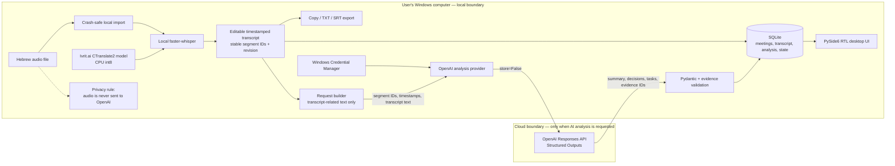

# Sikumon architecture

## High-level view

## Components and responsibilities

| Layer | Responsibility |
| --- | --- |
| PySide6 UI | Hebrew-first RTL workflow, meeting navigation, editing, progress, result views, evidence navigation, export, settings |
| Application services | Coordinate import, transcription, editing, analysis, cancellation, revision checks, and UI-safe background work |
| Local STT provider | Lazily loads the pinned Ivrit.ai model through faster-whisper/CTranslate2 and emits timestamped Hebrew segments |
| Analysis provider | Calls `OpenAI(...).responses.parse(..., text_format=MeetingAnalysisPayload, store=False)` |
| Validation | Pydantic checks structure; semantic validation rejects evidence IDs outside the supplied transcript |
| Repositories | SQLAlchemy-based transactional access to the SQLite meeting graph and operation state |
| Credential service | Reads/writes the OpenAI API key through keyring and Windows Credential Manager |
| Packaging | PyInstaller collects the runtime; Inno Setup creates the per-user Windows installer |

## Deliberate diarization trade-off

Speaker diarization is intentionally omitted in v0.1.0 to keep local transcription lightweight
and compatible with a wider range of Windows PCs, including CPU-only systems. Adding diarization
would require additional models and pipeline stages, increasing processing time, memory use,
packaging complexity, and minimum hardware requirements. Sikumon prioritizes reliable local Hebrew
speech-to-text on ordinary Windows PCs without requiring a dedicated GPU; the current transcript
therefore preserves timestamps and segment order but does not assign speaker identities.

## Local data and transaction boundaries

- Audio is copied into application-managed local storage with crash-consistent staging.
- A transcription candidate replaces the canonical transcript in one transaction; incomplete work
  never becomes the visible transcript.
- Every successful transcript content change increments a meeting revision. Stable segment UUIDs
  are retained for edits and regenerated for a replacement transcription.
- Analysis records the source transcript revision. The validated analysis graph and
  `current_analysis_id` are committed together only if that revision is still current.
- Operation status is persisted, allowing interrupted work to be reconciled on restart rather than
  remaining permanently “in progress”.

## Cloud boundary

Audio and the STT model remain local. The OpenAI request contains only the ordered canonical
transcript-related data needed for analysis: stable segment IDs, timestamps, and segment text.
Structured analysis is returned to the local validation layer and stored in SQLite only after
schema and evidence checks succeed. This is a local-first design, not a fully offline product:
OpenAI analysis and the initial STT model download require network access.
