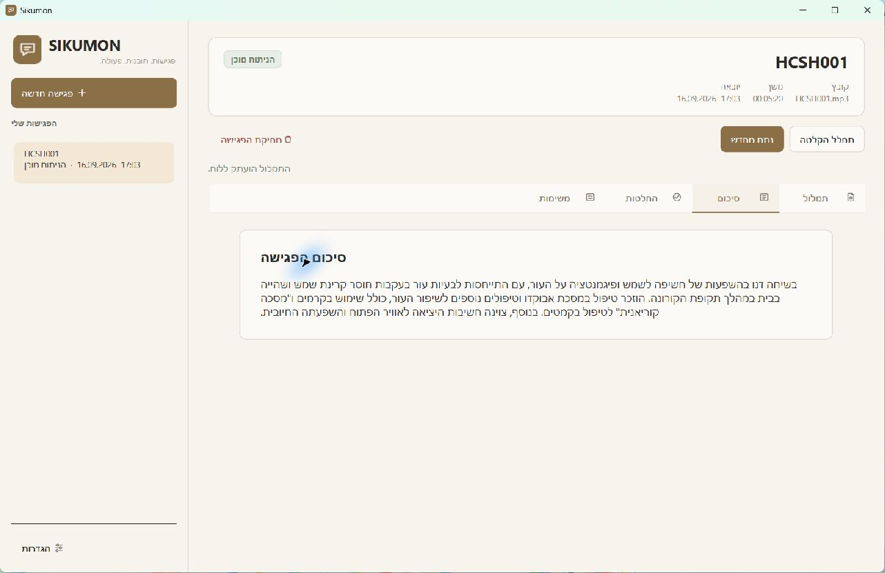
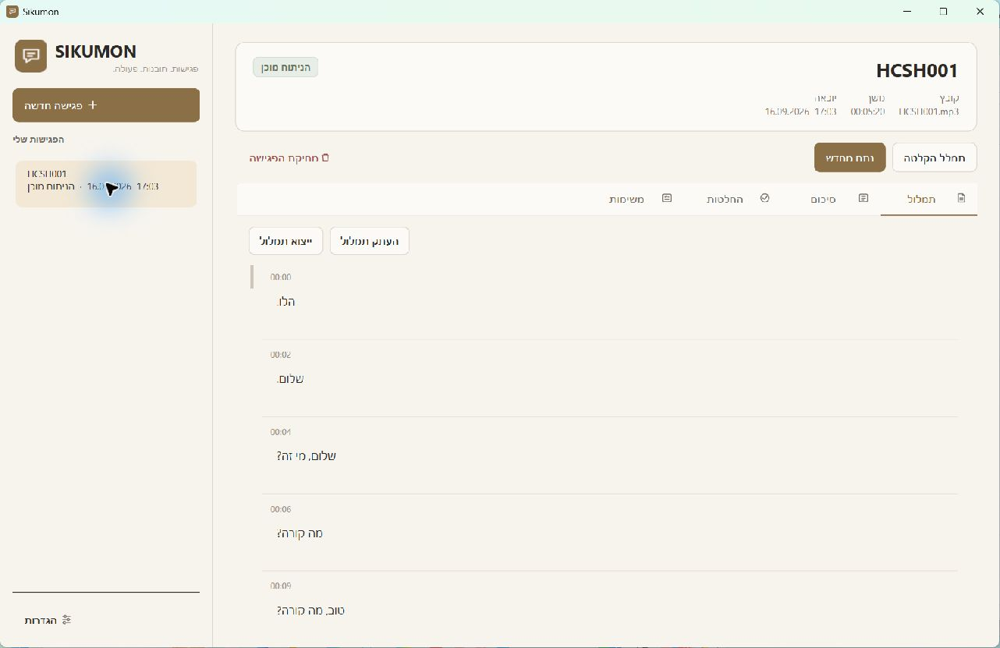
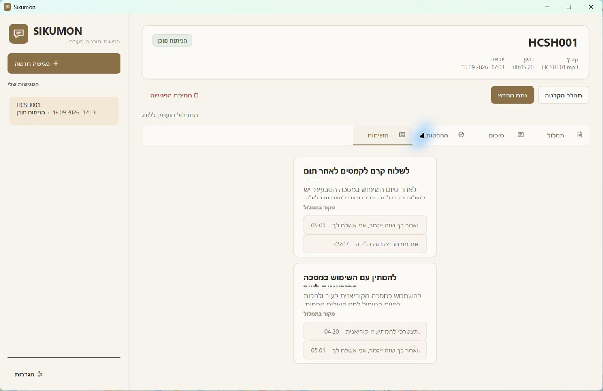
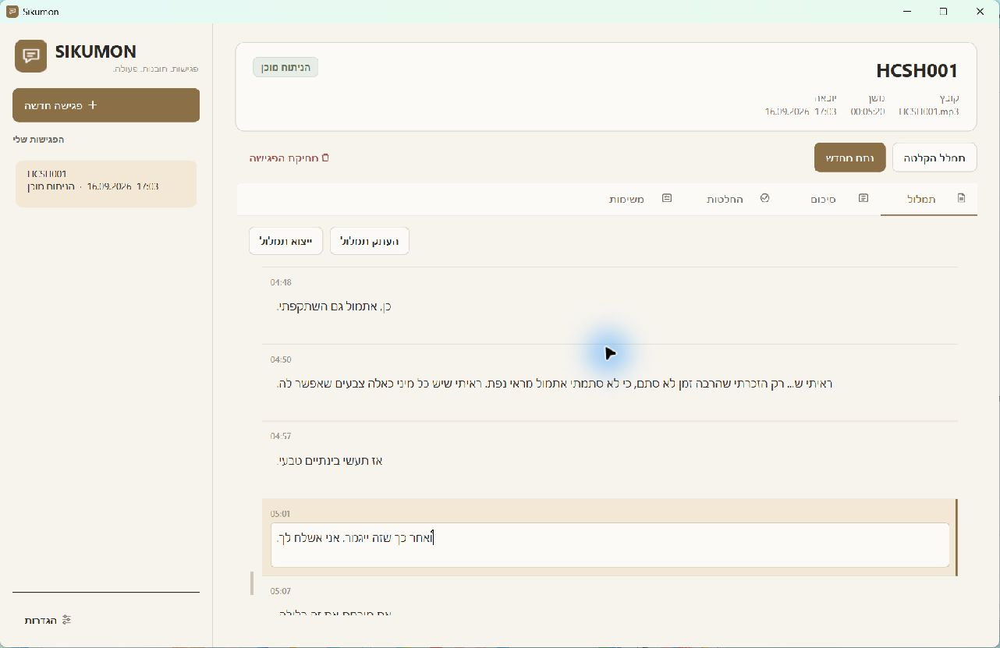
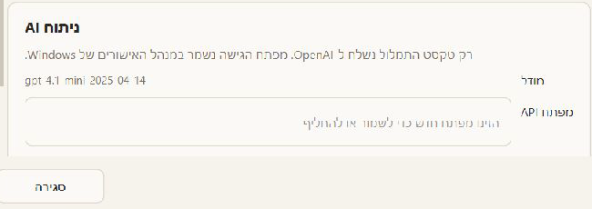

# Sikumon

## Hero

**Hebrew meetings in. Clear, traceable outcomes out.**

Sikumon is a native Windows meeting assistant that transcribes Hebrew audio locally, lets users
edit and export the transcript, and optionally creates evidence-grounded summaries, decisions, and
action items with OpenAI.

**Role:** product design, architecture, implementation, testing, packaging, and release validation  
**Platform:** Windows x64 · Python 3.12 · standalone installer  
**Status:** portfolio release 0.1.0

## Problem

Hebrew meeting recordings are valuable but difficult to review. Generic tools may require users to
upload audio, provide weak RTL editing, or produce AI notes that cannot be traced to the original
conversation. A useful desktop workflow needs local transcription, durable meeting state, clear
privacy boundaries, and results that users can verify.

## Solution

Sikumon imports an audio file into local application storage and performs Hebrew speech-to-text on
the user's computer. The user reviews an editable timestamped transcript, copies it, or exports
TXT/SRT. If the user requests AI analysis, Sikumon sends only transcript-related text to the OpenAI
Responses API and validates the structured response before storing it. Decisions and tasks link
back to exact source segments.

## Key features

- Local Hebrew STT with faster-whisper and a pinned Ivrit.ai CTranslate2 model
- Deliberately no speaker diarization in v0.1.0, keeping local STT lightweight and compatible with
  more Windows PCs, including CPU-only systems
- Native RTL transcript editing with timestamps and revision-safe saves
- Full-transcript copy plus UTF-8 TXT and SRT export
- Structured Hebrew summary, decisions, and action items
- Evidence navigation from analysis cards to exact transcript segments
- Transactional SQLite persistence and restart recovery
- Secure API-key storage through Windows Credential Manager
- Standalone per-user Windows installation

## Privacy

> Your audio stays on your computer.  
> Speech-to-text is performed locally.  
> Only transcript-related text is sent to OpenAI when AI analysis is requested.

The first STT model download and optional OpenAI analysis require network access. Local
transcription after model installation, editing, export, and saved meeting review do not require
an OpenAI request.

## Screenshots

### Editable transcript and export

### Structured action items with source evidence

### Evidence navigation

### Analysis settings

## Technology

Python 3.12 · PySide6 · faster-whisper · Ivrit.ai · CTranslate2 · SQLite · SQLAlchemy · Pydantic ·
OpenAI Responses API · keyring / Windows Credential Manager · PyInstaller · Inno Setup · pytest ·
Ruff · MyPy

## What I built

- The Hebrew-first desktop experience, RTL transcript editor, results views, evidence navigation,
  and background operation feedback
- Crash-consistent audio import, transactional transcript replacement/editing, revision tracking,
  and restart reconciliation
- Lazy local STT model loading and lifecycle management
- A deliberate CPU-first architecture that omits speaker diarization in v0.1.0 to avoid the
  additional models, memory use, and hardware requirements it would introduce
- Strict Structured Outputs analysis with one bounded correction retry and semantic evidence checks
- Credential storage, privacy boundary, export formats, and local persistence
- Reproducible Windows packaging, diagnosis of a Qt/ICU DLL conflict, installer creation, and
  packaged/installed application validation
- Automated unit, integration, smoke, lint, and type-check workflows

## Demo

The [one-minute demo](demo-script.md) shows import → local transcription → edit → optional AI
analysis → evidence navigation → export.

## Download

Portfolio build: **Sikumon 0.1.0 for Windows x64**  
Installer: `SikumonSetup.exe` · 141,280,565 bytes (141.28 MB / 134.74 MiB)  
SHA-256: `F032E37F972F58407C8F4F66E8E856299582F82688035863CBFDA013BAC8C79C`

The installer is unsigned, so Windows SmartScreen may report **Unknown Publisher**. The STT model
is downloaded separately after installation. Host the installer as a versioned GitHub Release
asset or a read-only Drive/OneDrive link; do not commit it to the source repository.
